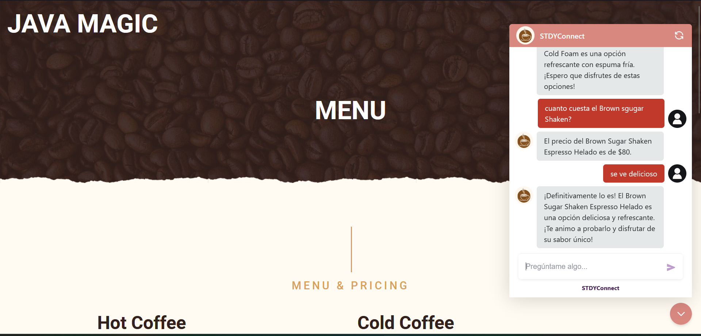

# Welcome to my Github profile 👋

  

¡Hello! I am Sebastian, Cloud Solutions Architect with background as developer. 
Highly proactive person with an innate passion for tackling challenges and finding effective solutions.

## About me

I am a technology enthusiast with experience in cloud and full stack development. I love learning about new technologies and creating innovative solutions. In my free time, I enjoy contributing to open source projects and sharing knowledge with the community.

## Relevant projects

### [AI Assistants](url_del_proyecto_1)

- Robust Cloud Architectures for web apps, data analitycs, AI projects and Hybrid Architectures.
- AI assistants: Building and evaluating RAG apps combining LLM knowledge with different data sets,
improving the ability of AI to provide contextually timely and accurate responses, also working closely with
cloud services.

### [STDY MATHS](url_del_proyecto_2)

STDY MATHS: Dynamic and interactive web application for learning and practice in the area of mathematics,
with a personalized experience, challenges, skills and continuous progress for each user.
Nextjs - Nodejs - MongoDB - Cloudinary - Aws Lambda

## Skills

- Programming languages: JavaScript, Python, Java.
- Frameworks: React, Node.js, Django, Nextjs, Flask, FastAPI, Langchain, Langgraph
- Cloud: AWS, OCI, GCP, Azure

## Contact

- LinkedIn: [sebastian-peña](https://www.linkedin.com/in/juan-sebastian-peña-angarita-5b6597271/)

