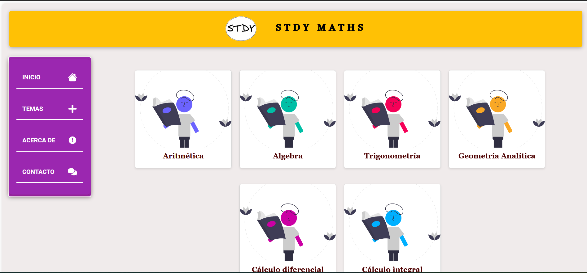

# Welcome to my Github profile 👋

¡Hello! I am Sebastian, FullStack developer. 
Highly proactive person with an innate passion for tackling challenges and finding effective solutions.

## About me

I am a technology enthusiast with experience in full stack development. I love learning about new technologies and creating innovative solutions. In my free time, I enjoy contributing to open source projects and sharing knowledge with the community.

## Relevant projects

### [AI Assistants](url_del_proyecto_1)

AI assistants: Building and evaluating RAG apps combining LLM knowledge with different data sets,
improving the ability of AI to provide contextually timely and accurate responses, also working closely with
cloud services.

### [STDY MATHS](url_del_proyecto_2)

STDY MATHS: Dynamic and interactive web application for learning and practice in the area of mathematics,
with a personalized experience, challenges, skills and continuous progress for each user.
Nextjs - Nodejs - MongoDB - Cloudinary - Aws Lambda

## Skills

- Programming languages: JavaScript, Python, Java.
- Frameworks: React, Node.js, Django, Nextjs, etc.
- Tools: Git, Docker, etc.

## Contact

- LinkedIn: [sebastian-peña](https://www.linkedin.com/in/sebastian-pe%C3%B1a-5b6597271/)

¡Gracias por visitar mi perfil! Si encuentras útiles mis proyectos o tienes alguna sugerencia, ¡no dudes en abrir un issue o enviar una pull request!

